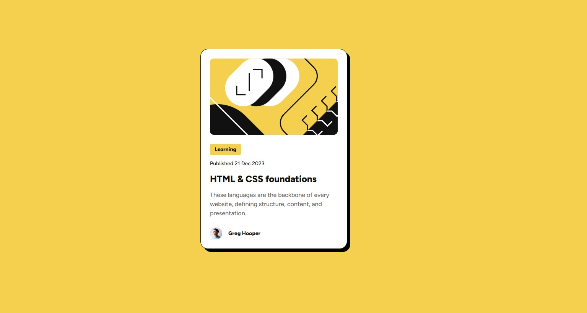

# Frontend Mentor - Blog preview card solution

This is a solution to the [Blog preview card challenge on Frontend Mentor](https://www.frontendmentor.io/challenges/blog-preview-card-ckPaj01IcS). Frontend Mentor challenges help you improve your coding skills by building realistic projects. 

## Table of contents

- [Overview](#overview)
  - [The challenge](#the-challenge)
  - [Screenshot](#screenshot)
  - [Links](#links)
- [My process](#my-process)
  - [Built with](#built-with)
  - [What I learned](#what-i-learned)

## Overview

### The challenge

Users should be able to:

- See hover and focus states for all interactive elements on the page

### Screenshot

### Links

- Solution URL: [Add solution URL here](https://your-solution-url.com)
- Live Site URL: [Add live site URL here](https://your-live-site-url.com)

## My process

### Built with

- Semantic HTML5 markup
- CSS custom properties

### What I learned

I intentionally avoided the use of Flexbox or Grid. I want to get a good understanding on how positioning in a website works. And I must admit that there are a few topics I struggled with.

Specially aligning author's picture and name. I struggled to understand where to apply the display property (parent? item? every item inside the parent?) and then I spend a lot of time researching until I found the vertical-align property.

I'm aware that the code lacks of responsiveness but I'm still getting my head around viewport sizes and rem values.
